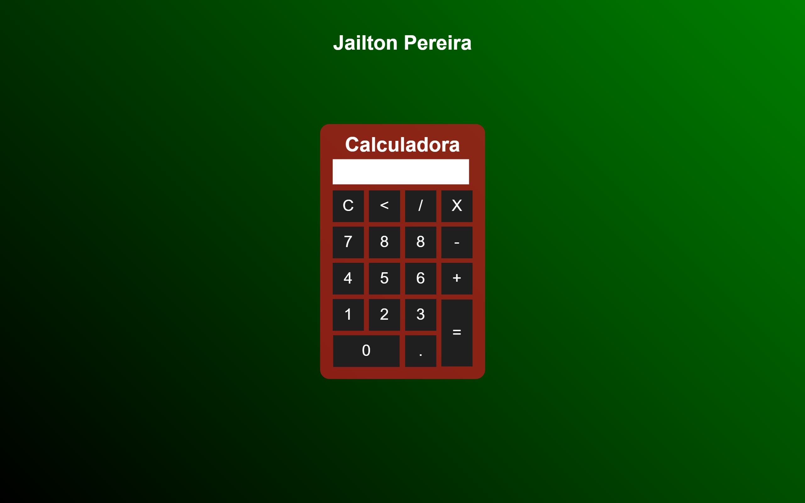

<h1 align="center"> Projeto de uma calculadora</h1>

  <a href="#-tecnologias">Tecnologias</a>&nbsp;&nbsp;&nbsp;|&nbsp;&nbsp;&nbsp;
  <a href="#-projeto">Projeto</a>&nbsp;&nbsp;&nbsp;|&nbsp;&nbsp;&nbsp;
  <a href="#-layout">Layout</a>&nbsp;&nbsp;&nbsp;|&nbsp;&nbsp;&nbsp;
  <a href="#memo-licença">Licença</a>

  

 

  

## 🚀 Tecnologias

Esse projeto foi desenvolvido com as seguintes tecnologias:

- HTML e CSS
- Git e Github
- JavaScript

## 💻 Projeto

Projeto que tinha como meta a construção de uma calculadora para treinar o conhecimento em CSS, HTML e JavaScript.

## 🌐 Deploy do projeto

- <a target="_blank" href="https://jailtonj.github.io/Studio-Ghibli/">Acesse aqui</a>

## :memo: Licença

Esse projeto está sob a licença MIT.

---
